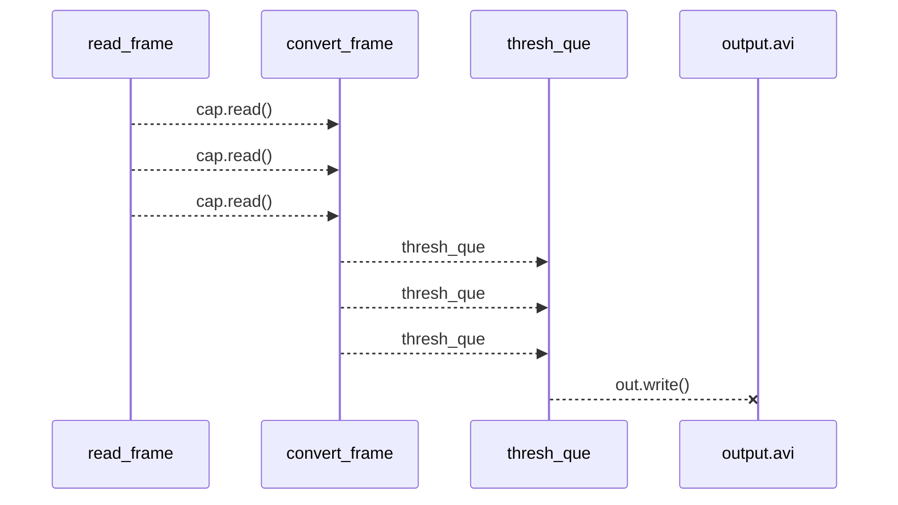

# convertVideo!

colored video file transform it into a B&W version.


# 第一阶段

完成实现彩色视频转换为黑白视频

# 第二阶段

完成了多线程处理视频并有序保存

## 缺点

时间原因没有定义系统格式的命令提示

```
argv = ['./Megamind.avi','./output.avi',3]
```
第一参数 原始彩色视频路径
第二参数 转换后黑白视频路径
第一参数 线程数量
## UML

大致图解


